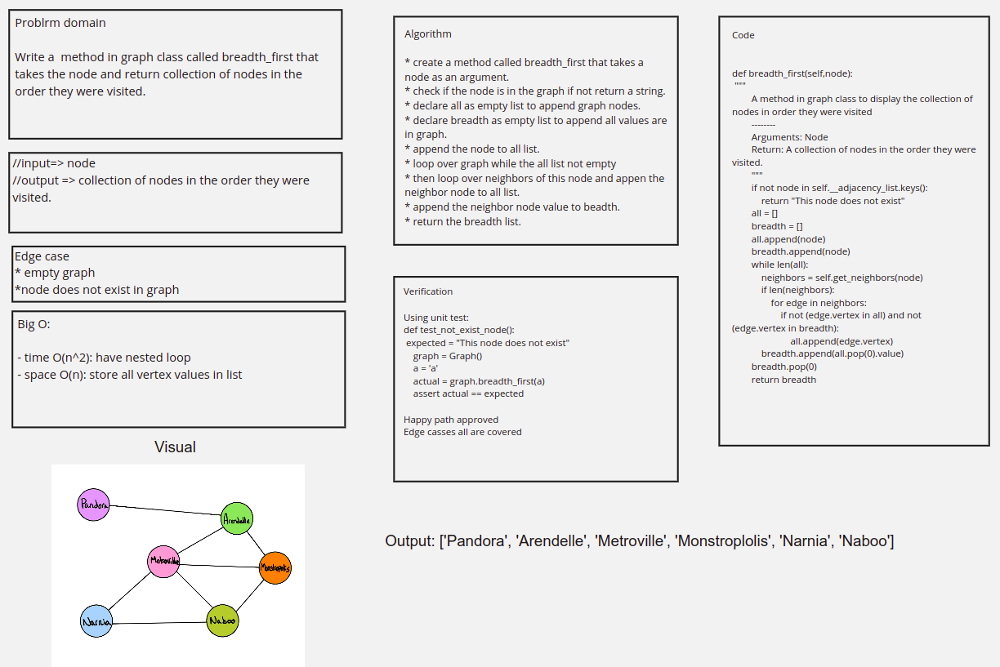

# Graph breadth first

## Code

[Code](graph_breadth_first.py)

## Challenge Summary

write a method for the Graph class called breadth first, that takes a Node as an argument, and returns the collection of nodes in the order they were visited.

## Whiteboard Process



## Approach & Efficiency

for the approach used, i used two lists, one for storing all the nodes inside it, and one for storing the nodes breadth first one by one, with a while loop over the array that is going to contain all the values, and only has the base value in the beginning, we check if the first node inside the 'all' list have edges or not, if it has, after checking that they are not duplicated, we store them inside 'all' list, and store the first value inside 'all' list inside 'breadth' list and pop the element from 'all', when 'all' is empty, return 'breadth' list.

Big O

- time O(n^2): the nested loops inside each other

- space O(n): we have an list completely depending on the values inside the graph

## Solution

the solution is just defining two arrays, one for pushing all the values inside it, and one for the exact sort of which the values were stored inside the graph

```python
def breadth_first(self,node):
        """
        A method in graph class to display the collection of nodes in order they were visited
        --------
        Arguments: Node
        Return: A collection of nodes in the order they were visited.
        """
        if not node in self.__adjacency_list.keys():
            return "This node does not exist"
        all = []
        breadth = []
        all.append(node)
        breadth.append(node)
        while len(all):
            neighbors = self.get_neighbors(node)
            if len(neighbors):
                for edge in neighbors:
                    if not (edge.vertex in all) and not (edge.vertex in breadth):
                        all.append(edge.vertex)
            breadth.append(all.pop(0).value)
            if len(all):
                node = all[0]
        breadth.pop(0)
        return breadth
```
