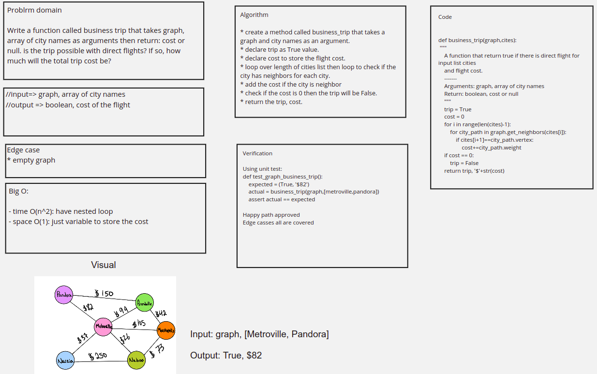

# Graph business trip

## Code

[Code](graph_business_trip.py)

## Challenge Summary

Write a function called business trip that takes graph, array of city names as arguments then return: cost or null. Is the trip possible with direct flights? If so, how much will the total trip cost be?

## Whiteboard Process



## Approach & Efficiency

create a function called business_trip that takes a graph and city names as an argument. declare trip as True value. declare cost to store the flight cost. Then loop over length of cities list then loop to check if the city has neighbors for each city. after taht add the cost if the city is neighborcheck if the cost is 0 then the trip will be False. finally return the trip, cost.

Big O

- time O(n^2): the nested loops inside each other

- space O(1): just a variable to store the cost

## Solution

```python
def business_trip(graph,cites):
    """
    A function that return true if there is direct flight for input list cities
    and flight cost.
    -------
    Arguments: graph, array of city names
    Return: boolean, cost or null
    """
    trip = True
    cost = 0
    for i in range(len(cites)-1):
        for city_path in graph.get_neighbors(cites[i]):
            if cites[i+1]==city_path.vertex:
                cost+=city_path.weight
    if cost == 0:
        trip = False
    return trip, '$'+str(cost)
```
