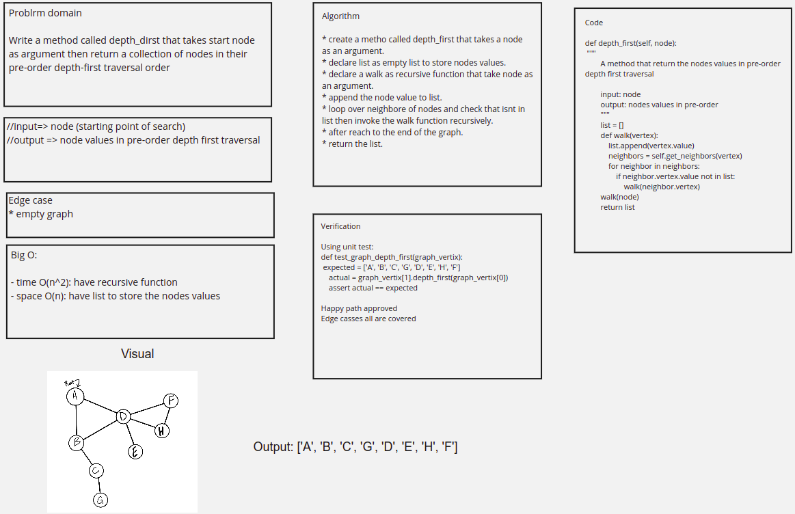

# Depth First Traversal

## Code

[Code](graph_depth_first.py)

## Challenge Summary

Write a method called depth_dirst that takes start node as argument then return a collection of nodes in their pre-order depth-first traversal order.

## Whiteboard Process



## Approach & Efficiency

create a metho called depth_first that takes a node as an argument. thendeclare list as empty list to store nodes values nad declare a walk as recursive function that take node as an argument. after that append the node value to list and loop over neighbore of nodes and check that isnt in list then invoke the walk function recursively after reach to the end of the graph return the list.

Big O

- time O(n^2): have recursive function depends on the nighbors values of the node.

- space O(n): have a list to store the nodes values

## Solution

```python
def depth_first(self, node):
        """
        A method that return the nodes values in pre-order depth first traversal

        input: node
        output: nodes values in pre-order
        """
        list = []
        def walk(vertex):
            list.append(vertex.value)
            neighbors = self.get_neighbors(vertex)
            for neighbor in neighbors:
                if neighbor.vertex.value not in list:
                    walk(neighbor.vertex)
        walk(node)
        return list
```
