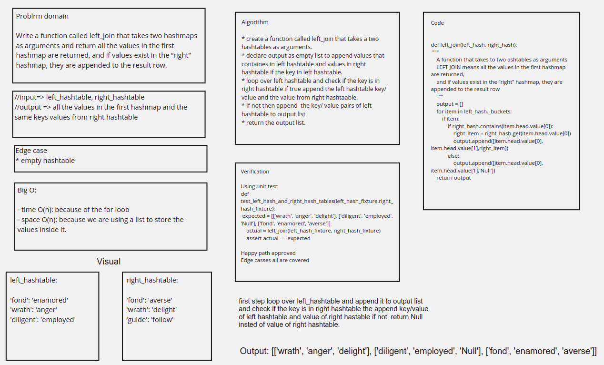

# Hashmap left join

## Code Link

[Code](hashmap_left_join.py)

## Hashmap LEFT JOIN

The Hashmap LEFT JOIN returns an array that contains all the keys and the values from the left has table, with the values for the right hash tables if they have the same key

## Challenge

Write a function called left join, that takes two hashtables as an input, and returns an array that has the keys and values for the left hashmap, and the values from the right hashmap if they have the same key

## Whiteboard



## Approach & Efficiency

first step loop over left_hashtable and append it to output list and check if the key is in right hashtable the append key/value of left hashtable and value of right hastable if not  return Null insted of value of right hashtable.

Big O:

- time O(n): because of the for loob
- space O(n): because we are using a list to store the values inside it.

## Solution

```python
def left_join(left_hash, right_hash):
    """
    A function that takes to two ashtables as arguments
    LEFT JOIN means all the values in the first hashmap are returned,
    and if values exist in the “right” hashmap, they are appended to the result row
    """
    output = []
    for item in left_hash._buckets:
        if item:
            if right_hash.contains(item.head.value[0]):
                right_item = right_hash.get(item.head.value[0])
                output.append([item.head.value[0], item.head.value[1],right_item])
            else:
                output.append([item.head.value[0], item.head.value[1],'Null'])
    return output
```
