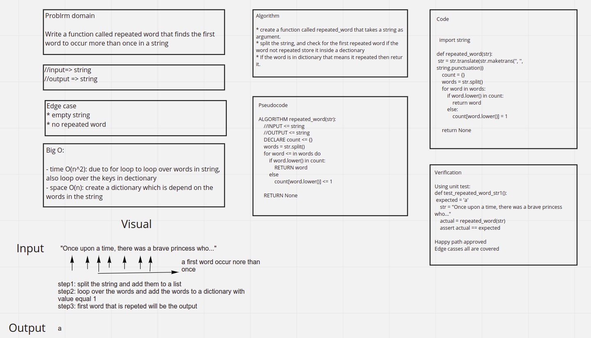

# Hashmap repeated word

## Code Link

[Code](hashmap_repeated_words/hashmap.py)

## Challenge Summary

Write a function called repeated word that finds the first word to occur more than once in a string, it should take a string and return a string.

## Whiteboard Process



## Approach & Efficiency

The approach taken is first removing all the punctuation from the string, splitting the string, then store the string inside a dictionary as a key if it's not a key, and if it's a key, the word will be returned as the first duplicated word.

Big O:

- time O(n^2): due to for loop to loop over words in string, also loop over the keys in dectionary
- space O(n): create a dictionary which is depend on the words in the string

## Solution

for the solution, i made sure that there will be no way an edge case is not taken care of, the following block of code is the complete solution

```python
import string

def repeated_word(str):
    str = str.translate(str.maketrans('', '', string.punctuation))
    count = {}
    words = str.split()
    for word in words:
        if word.lower() in count:
            return word
        else:
            count[word.lower()] = 1

    return None
```
