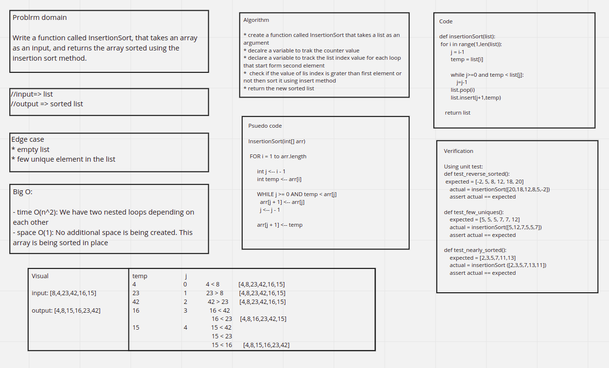

# Insertion sort

## Code link

[Code](insertion_sort.py)

## Blog

[Blog](BLOG.md)

## Challenge Summary

Write a function called SelectionSort, that takes an array as an input, and returns the array sorted using the insertion sort method.

## Whiteboard Process



## Approach & Efficiency

the approach that has been used is creating a nested loops, one to loop over the elements one by one, and one for allocating every element at it's appropriate position, the second one keeps checking for the temporary value if it's smaller than the array at a certain position, if it's larger, we relocate the value to this specific place.

for the time and space complexity, the time complexity is O(n^2), and the space complexity is O(1)

## Solution

the solution is by simply looping over the entire array, locating every element based on which one is bigger, and then return the new sorted array, this is the solution:

```python
def insertionSort(arr):
    for i in range(1,len(arr)):
        j = i-1
        temp = arr[i]

        while j>=0 and temp < arr[j]:
            j=j-1
        arr.pop(i)
        arr.insert(j+1,temp)

    return arr
```
