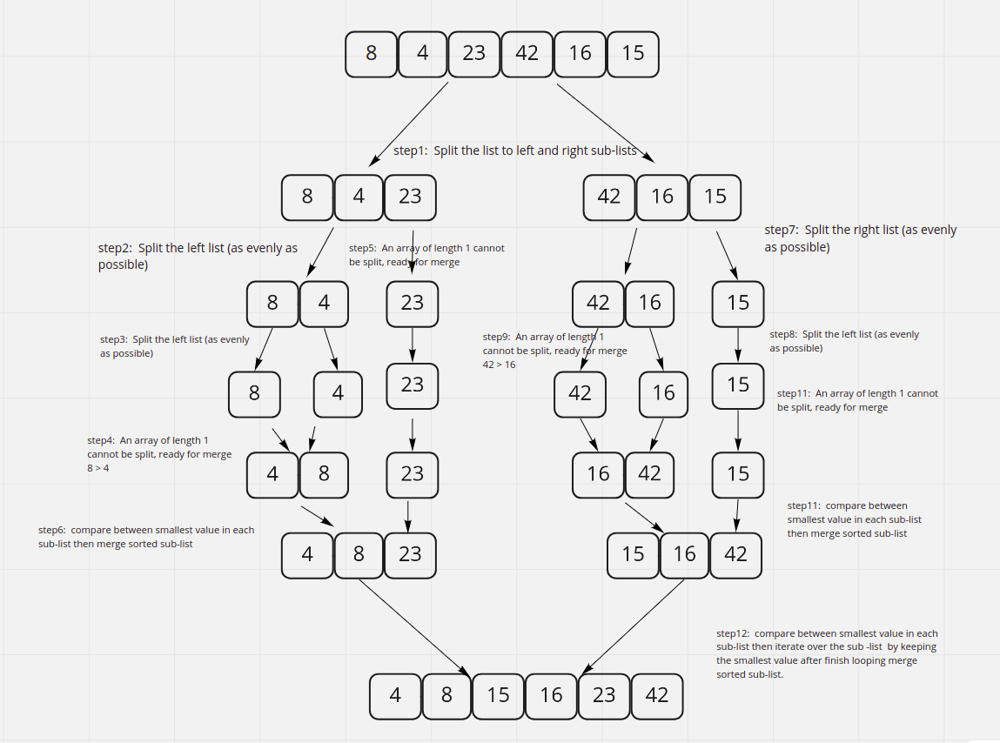

# Merge Sort

Merge sort is one of the most efficient sorting algorithms. It works on the principle of Divide and Conquer. Merge sort repeatedly breaks down a list into several sub-lists until each sub-list consists of a single element and merging those sub-lists in a manner that results into a sorted list.

## Tracing

## Efficiency

- time complexity => O(nlogn), By dividing the array into half every time, so it's log(n), then, with the recursive call, and merging them back with iterative n, so it is log(n^n), which is nlog(n)

- space complexity => O(n), we divide the list into sub-lists depending on while loops to fill.
