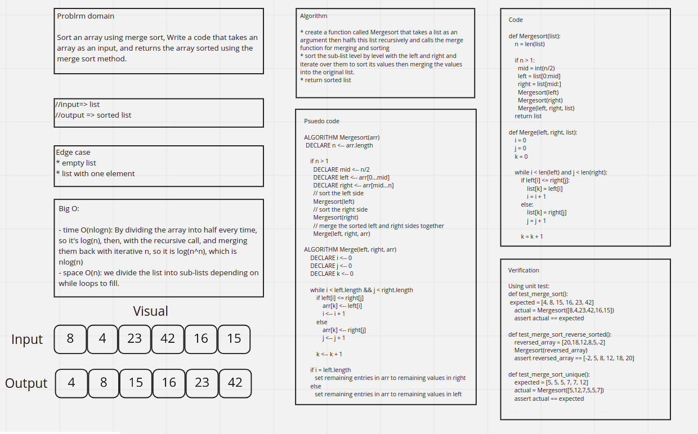

# Merge Sort

## Code

[code](merge_sort.py)

## Blog

[Blog](BLOG.md)

## Challenge Summary

Sort an array using merge sort, Write a code that takes an array as an input, and returns the array sorted using the merge sort method.

## Whiteboard Process



## Approach & Efficiency

the approach used is dividing the array multiple times until the arrays are of the length of 1, then we start sorting the array by comparing left and right value in each iteration, the smaller one enters first.

as the call is recursive, it's gonna check the levels one by one, and the left/right array's size will increase step by step, until we reach the final step when combing the two arrays, comparing the first value from both sides, then storing in the main array the sorted values

- time complexity => O(nlogn), By dividing the array into half every time, so it's log(n), then, with the recursive call, and merging them back with iterative n, so it is log(n^n), which is nlog(n)

- space complexity => O(n), we divide the list into sub-lists depending on while loops to fill.

## Solution

for the solution, you just need to insert any numeric array, and the algorithm will sort the array, let's say for an example, the user enters [8 ,4 ,23 ,42 ,16 ,15] for an input, the array will become like this [4, 8, 15, 16, 23, 42] after sorting, the following block is the code

```python
def Mergesort(list):
    """
    A function so split the list to sub-lists until each sub-list consists of a single element
    """
    n = len(list)

    if n > 1:
      mid = int(n/2)
      left = list[0:mid]
      right = list[mid:]
      Mergesort(left)
      Mergesort(right)
      Merge(left, right, list)
    return list

def Merge(left, right, list):
    """
    A function that merging those sub-lists in a manner that results into a sorted list.
    """
    i = 0
    j = 0
    k = 0

    while i < len(left) and j < len(right):
        if left[i] <= right[j]:
            list[k] = left[i]
            i = i + 1
        else:
            list[k] = right[j]
            j = j + 1

        k = k + 1

    while i < len(left):
            list[k] = left[i]
            i += 1
            k += 1
    while j < len(right):
            list[k] = right[j]
            j += 1
            k += 1
```
