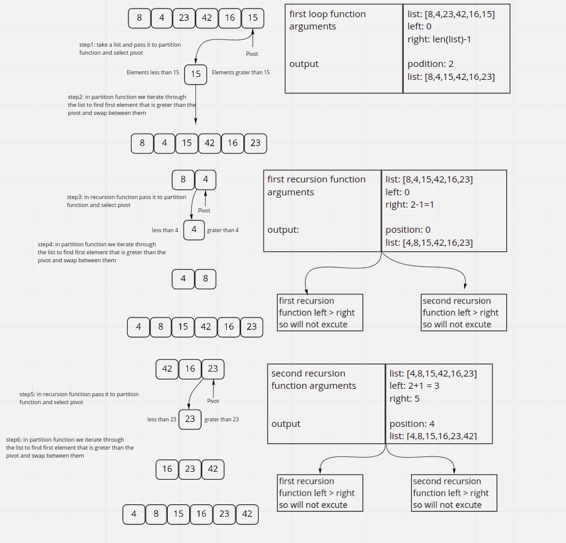

# Quick Sort

QuickSort is a Divide and Conquer algorithm. It picks an element as pivot and partitions the given array around the picked pivot. There are many different versions of quickSort that pick pivot in different ways.

## Tracing

## Efficiency

- time O(n^2): due to the recursive call, we are looping over every element inside the array n times.

- Space O(n): we have arrays depending on for loop to fill
