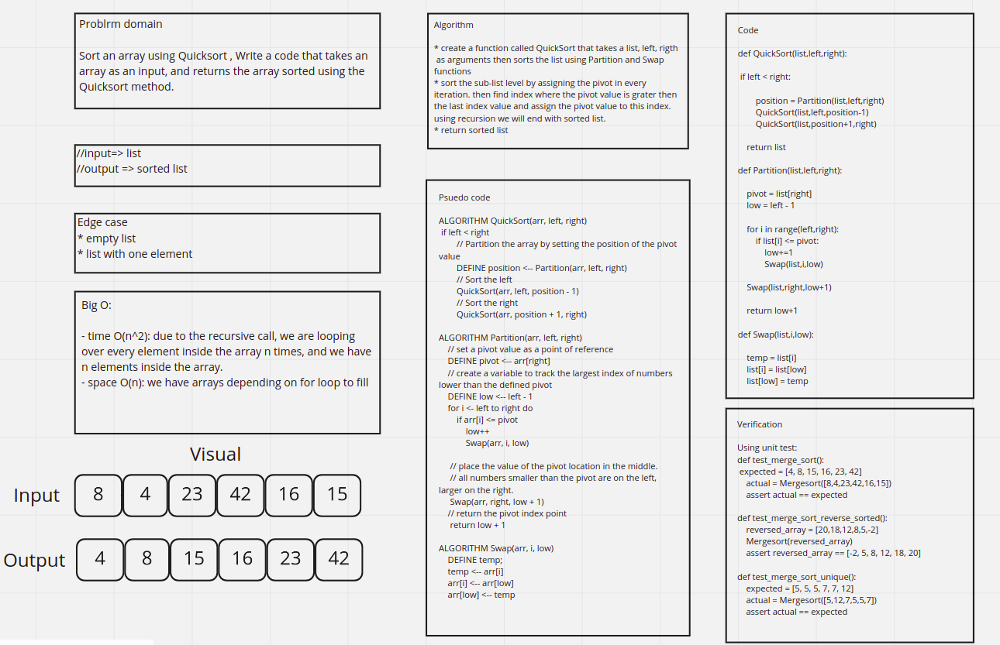

# Quick Sort

## Code

[code](quick_sort.py)

## Blog

[Blog](BLOG.md)

## Challenge Summary

Sort an array using Quicksort , Write a code that takes an array as an input, and returns the array sorted using the Quicksort method.

## Whiteboard Process



## Approach & Efficiency

the approach used is selecting the pivot to be the the last element of the array, and sorting the values so the values on the left of the pivot would be the values smaller, and the values on the right would be larger, by this step, we would determine specifically where is the pivot located. after that, we deal with the pivot's right elements and left elements separately by calling the function recursively, setting pivots and sorting arrays, at the end, we just combine every array back together to form a sorted array

- time O(n^2): due to the recursive call, we are looping over every element inside the array n times.

- Space O(n): we have arrays depending on for loop to fill

## Solution

for the solution, you just need to insert any numeric array, and the algorithm will sort the array, let's say for an example, the user enters [8,4,23,42,16,15] for an input, the array will become like this [4, 8, 15, 16, 23, 42] after sorting, the following block is the code

```python
def QuickSort(list,left,right):

    if left < right:

        position = Partition(list,left,right)
        QuickSort(list,left,position-1)
        QuickSort(list,position+1,right)

    return list

def Partition(list,left,right):

    pivot = list[right]
    low = left - 1

    for i in range(left,right):
        if list[i] <= pivot:
            low+=1
            Swap(list,i,low)

    Swap(list,right,low+1)

    return low+1

def Swap(list,i,low):

    temp = list[i]
    list[i] = list[low]
    list[low] = temp
```
