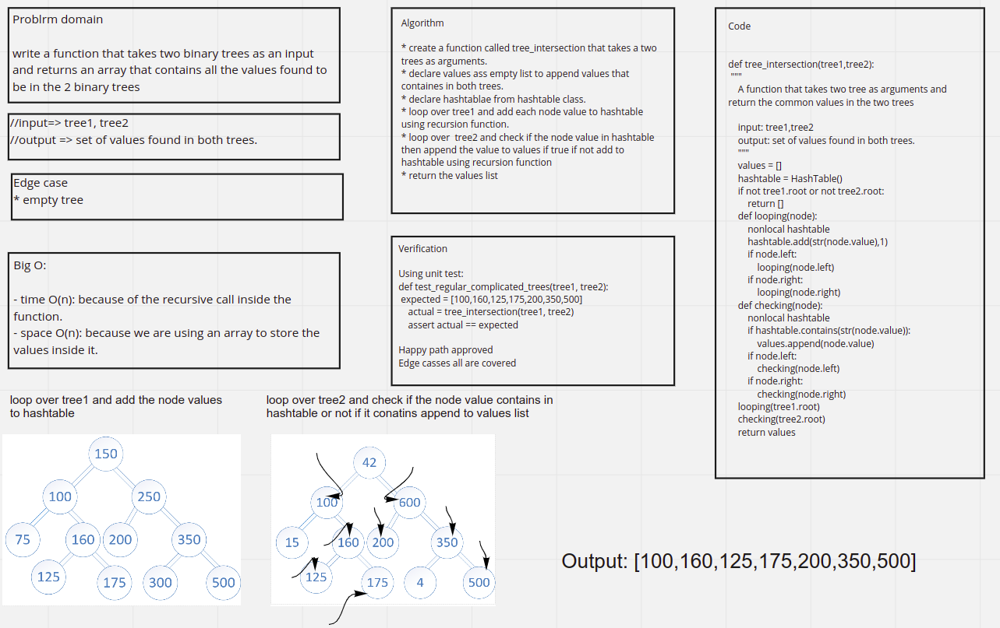

# tree intersection

## Code link

[Code](tree_intersection.py)

## Challenge Summary

write a function that takes two binary trees as an input and returns an array that contains all the values found to be in the 2 binary trees

## Whiteboard Process



## Approach & Efficiency

the approach used is utilizing a hash table to save the first tree values inside it, then with the second one to check if the hash table contains the keys, if it contains a certain key, this means that this key is duplicated and should be stored inside the return array

Big O

- time O(n): because of the recursive call inside the function.

- space O(n): because we are using an array to store the values inside it.

## Solution

as for the solution, there were two paths that i decided to take, the one that doesn't deal with hash tables (the comment one), and the one depending on hash tables, the second one is better when it comes to Big O, but the first one is easier to understand and handle.

```python
def tree_intersection(tree1,tree2):
    """
    A function that takes two tree as arguments and return the common values in the two trees

    input: tree1,tree2
    output: set of values found in both trees.
    """
    values = []
    hashtable = HashTable()
    if not tree1.root or not tree2.root:
        return []
    def looping(node):
        nonlocal hashtable
        hashtable.add(str(node.value),1)
        if node.left:
            looping(node.left)
        if node.right:
            looping(node.right)
    def checking(node):
        nonlocal hashtable
        if hashtable.contains(str(node.value)):
            values.append(node.value)
        if node.left:
            checking(node.left)
        if node.right:
            checking(node.right)
    looping(tree1.root)
    checking(tree2.root)
    return values
```
